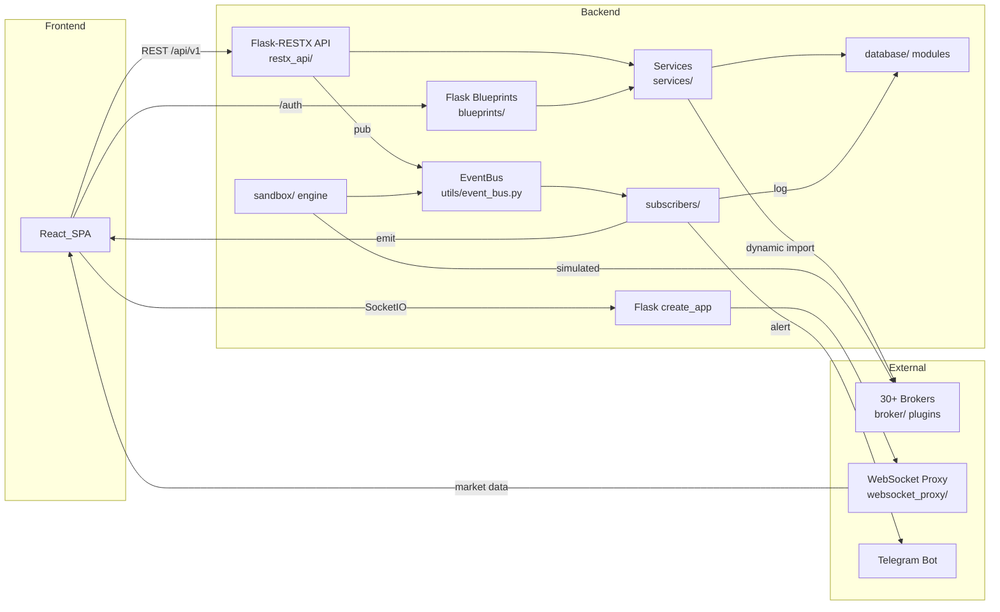

# Repository Guidelines

## Project Overview

**OpenAlgo** (v2.0.1.0) is a broker-agnostic, open-source algorithmic trading automation platform. It provides a unified API over 30+ Indian brokers (Zerodha, Upstox, Angel One, etc.), a paper-trading sandbox for strategy backtesting, a Telegram-based trading interface, a visual strategy builder, and a React SPA dashboard. The backend is Python/Flask, frontend is React + Vite + TypeScript.

---

## Architecture & Data Flow



### Layered Architecture

| Layer | Directory | Role |
|---|---|---|
| **Entry/Config** | `app.py`, `extensions.py`, `csp.py`, `cors.py`, `limiter.py` | Flask app factory, middleware wiring |
| **API (REST)** | `restx_api/` | 46+ Flask-RESTX namespaces under `/api/v1` |
| **UI Routes** | `blueprints/` | Flask blueprints: Jinja2 templates + JSON endpoints |
| **Business Logic** | `services/` | ~70 pure-function modules, `tuple[bool, dict, int]` return pattern |
| **Database** | `database/` | ~30 SQLAlchemy modules, one-engine-per-module pattern |
| **Event Bus** | `utils/event_bus.py`, `events/`, `subscribers/` | In-process pub/sub with ThreadPoolExecutor dispatch |
| **Paper Trading** | `sandbox/` | Fully simulated brokerage with dual execution paths |
| **Broker Adapters** | `broker/<name>/` | Plugin-based broker integrations, ~36 adapters |
| **WebSocket Proxy** | `websocket_proxy/` | Market data streaming via ZeroMQ PUB |
| **Frontend** | `frontend/src/` | React 19 SPA, Vite 7, TypeScript strict |

### Data Flow

1. **User actions** → React SPA → HTTP to `/api/v1/*` (RESTX) or SocketIO events
2. **RESTX handlers** validate via Marshmallow schemas, delegate to `services/` functions
3. **Services** dynamically import broker modules, call broker REST APIs, return `(success, data, status)`
4. **On completion**, events published via `EventBus` → `subscribers/` handle: log DB writes, SocketIO push to UI, Telegram alerts
5. **Sandbox (analyzer mode)**: same API surface but routes through `sandbox/` modules instead of real brokers. Dual execution: polling (5s interval) or WebSocket-driven (sub-second LTP ticks)
6. **WebSocket proxy** manages 25+ broker WebSocket connections, distributes ticks via ZeroMQ, frontend consumes via SocketIO

---

## Key Directories

| Directory | Purpose |
|---|---|
| `app.py` | Flask app factory — registers all extensions, blueprints, error handlers |
| `restx_api/` | Flask-RESTX API namespaces (place_order, ticker, analyzer, close_position, etc.) |
| `blueprints/` | Flask blueprints (strategy, telegram, settings, admin, python_strategy, etc.) |
| `services/` | Business logic layer — broker-agnostic service functions |
| `sandbox/` | Paper trading simulation — order/position/fund/holdings managers, dual execution engines |
| `broker/<name>/` | Broker plugin (api/, streaming/, mapping/, database/, plugin.json) |
| `websocket_proxy/` | WebSocket proxy server, broker adapter factory, connection manager |
| `database/` | SQLAlchemy ORM modules — one module per domain (auth, symbol, strategy, sandbox, etc.) |
| `events/` | Event dataclasses (OrderEvent, SandboxOrderFilledEvent, etc.) |
| `subscribers/` | Event bus subscribers — logging, SocketIO push, Telegram alerts |
| `utils/` | Utilities — logging, event_bus, session management, constants, env_check |
| `frontend/src/` | React 19 SPA — pages/ (feature-based), components/ui/ (shadcn), stores/ (Zustand), api/, hooks/ |
| `strategies/` | User-uploaded Python strategy scripts, run as isolated subprocesses |
| `install/` | Deployment scripts (bare-metal, Docker, multi-user, SSL) |
| `upgrade/` | Database migration scripts (inline ALTER TABLE, no Alembic) |
| `test/` | Pytest tests + standalone integration scripts |
| `db/` | SQLite database files (openalgo.db, sandbox.db, logs.db, health.db, latency.db, historify.duckdb) |

---

## Development Commands

### Backend

```bash
# Install dependencies
uv sync                            # recommended — install from pyproject.toml
pip install -r requirements.txt    # alternative

# Run development server
python app.py                      # Flask dev server (port 5000)
uv run python app.py               # via uv

# Run with WebSocket proxy (in separate terminal)
uv run python websocket_proxy/server.py

# Lint & format
uv run ruff check .                # lint check
uv run ruff check . --fix          # auto-fix
uv run ruff format .               # format

# Run tests (CI-safe subset - 6 files)
uv run pytest test/test_log_location.py test/test_navigation_update.py test/test_python_editor.py test/test_rate_limits_simple.py test/test_logout_csrf.py -v --timeout=60

# Run any test file
uv run pytest test/<file>.py -v
python test/<file>.py              # for script-style tests (not pytest)

# Security scan
uv run bandit -r . -f json
uv run pip-audit
```

### Frontend

```bash
cd frontend

# Install
npm install

# Dev server (port 5173, proxies /api to :5000)
npm run dev

# Build
npm run build                      # tsc -b && vite build

# Lint & format (Biome - no ESLint/Prettier)
npm run lint                       # biome lint ./src
npm run format                     # biome format --write ./src
npm run check                      # biome check --write ./src

# Test
npm run test                       # vitest (watch mode)
npm run test:run                   # vitest run
npm run test:coverage              # vitest run --coverage

# E2E (Playwright)
npm run e2e                        # playwright test
npm run e2e:ui                     # playwright test --ui
```

### Docker

```bash
docker compose up -d               # start full stack
docker compose logs -f             # follow logs
docker compose down                # stop

# Multi-arch build
bash docker-build.sh
```

---

## Code Conventions & Common Patterns

### Python

**Naming**: `snake_case` for files, functions, variables. `PascalCase` for classes. `UPPER_CASE` for constants.

**String formatting**: f-strings exclusively. Never `%` formatting.

**Type hints**: Used moderately — function signatures typed (`def foo(name: str) -> bool`), but not everywhere. New code should include them.

**Imports**: Grouped: stdlib → third-party → local. Absolute imports preferred (`from database.auth_db import get_auth_token_broker`). Dynamic importlib used for broker modules.

**Error handling**: Service functions return `tuple[bool, dict, int]` = `(success, data, status_code)`. RESTX handlers wrap in `try/except ValidationError` and `except Exception`. Global error handlers in `app.py` for 400/403/404/429/500.

**Logging**: Centralized via `get_logger(__name__)` at module level. `SensitiveDataFilter` redacts API keys/tokens. Levels: debug (verbose), info (state changes), warning (recoverable), error (failures). `# NOTE:`, `# IMPORTANT:`, `# CRITICAL:` markers in comments.

**Docstrings**: Triple-quoted on public functions with `Args:` and `Returns:` sections.

**Async**: **Production runs on eventlet+Gunicorn (single worker, `--worker-class eventlet`)** — incompatible with `asyncio`. Dev server uses standard threading. SocketIO uses `async_mode='threading'`. Background tasks via `threading.Thread`, `ThreadPoolExecutor`, or APScheduler.

**Database**: Each `database/*.py` module creates its own `engine` + `scoped_session`. `NullPool` for SQLite, `pool_size=50` for PostgreSQL. `Base.query = db_session.query_property()` enables `Model.query.filter_by(...)`. Session cleanup via `@app.teardown_appcontext` handler.

**Caching**: `cachetools.TTLCache` per module. TTLs: 30s (auth) to 1hr (settings). Manual invalidation on writes. `token_db_enhanced.py` uses full in-memory multi-index cache for 100k+ symbols.

**Encryption**: Fernet + PBKDF2(SHA256) over `API_KEY_PEPPER` env var. Used for TOTP secrets, API keys, SMTP passwords.

**Broker plugins**: Ad-hoc plugin system — each broker in `broker/<name>/` with `plugin.json` metadata. REST API via `api/order_api.py` (exported functions). WebSocket via `streaming/<name>_adapter.py` (extends ABC). Registered statically in `websocket_proxy/__init__.py` + dynamic fallback via `importlib`.

**Event Bus**: Singleton `EventBus` with topic-based routing. Topics: `order.placed`, `order.failed`, `sandbox.*`, etc. `ThreadPoolExecutor(10)` for async dispatch. `_safe_call()` isolates per-subscriber failures.

**Service layer**: Pure functions, not classes. Return `(success_bool, response_dict, status_code_int)`. Dynamic broker imports via `importlib.import_module(f'broker.{broker_name}.api.order_api')`.

### TypeScript / React

**Naming**: `PascalCase` for components and files. `camelCase` for functions, variables. `kebab-case` for CSS classes.

**Formatting**: Biome 2.3 (not Prettier) — 2-space indent, single quotes, `asNeeded` semicolons. Run `npm run check`.

**Strict TypeScript**: `strict: true`, `noUnusedLocals`, `noUnusedParameters`, `verbatimModuleSyntax`, ES2022 target.

**Imports**: `@/` path alias maps to `src/`. Barrel re-exports from `src/components/ui/`.

**Components**: Function components with hooks. shadcn/ui pattern — Radix primitives + `class-variance-authority` + `tailwind-merge cn()`.

**State**: Zustand 5 for client state (auth, theme, alerts) with `persist` middleware. TanStack Query 5 for server state (1min staleTime, refetchOnWindowFocus, 1 retry).

**API**: Three Axios clients (`apiClient`, `authClient`, `webClient`) with CSRF auto-fetch, 401 redirect interceptor. Domain API files export typed functions.

**WebSocket**: `socket.io-client` with polling transport only (no WS upgrade — threading limitation). Connection gated on auth. Handles order events, alerts, analyzer updates.

**Routing**: React Router v7 — `BrowserRouter` with lazy-loaded pages. Guards for auth, broker config, crypto-only features.

**Styling**: Tailwind CSS v4 (CSS-only config, no `tailwind.config.ts`). CSS variables for light/dark/analyzer/sandbox themes. Neutral accent color base, green/blue/violet/orange/slate/gray variants.

---

## Important Files

| File | Purpose |
|---|---|
| `app.py` | Flask app factory, blueprints/extensions registration, error handlers, teardown |
| `extensions.py` | SocketIO singleton (`async_mode='threading'`) |
| `csp.py` | Content Security Policy middleware + security headers |
| `cors.py` | CORS config (disabled by default) |
| `limiter.py` | Rate limiter (Flask-Limiter, memory storage) |
| `restx_api/__init__.py` | RESTX Api instance with 46+ namespaces |
| `restx_api/schemas.py` | Marshmallow schemas for all order types |
| `events/__init__.py` | All event type exports |
| `events/order_events.py` | 17 order lifecycle event dataclasses |
| `subscribers/__init__.py` | `register_all()` — wires subscribers to event topics |
| `utils/event_bus.py` | In-process pub/sub singleton |
| `utils/session.py` | Session management, daily expiry, `@check_session_validity` decorator |
| `utils/constants.py` | Global constants: exchanges, product types, price types, actions |
| `utils/logging.py` | Logging setup: ColoredFormatter, SensitiveDataFilter, rotation |
| `utils/env_check.py` | Startup validation: secret rotation, compromised-key detection |
| `database/auth_db.py` | Central auth: broker tokens, API keys, Fernet encryption, login audit (1101 lines) |
| `database/symbol.py` | Core symbol/token model, search, expiry/underlying queries |
| `database/token_db_enhanced.py` | In-memory symbol cache (100k+ entries, multi-index O(1) lookup) |
| `database/sandbox_db.py` | Sandbox simulation models (orders, trades, positions, funds, holdings) |
| `database/historify_db.py` | DuckDB historical data (3525 lines — largest DB module) |
| `sandbox/order_manager.py` | Order validation/placement — lot size, product compat, MIS windows |
| `sandbox/fund_manager.py` | Simulated capital with `threading.RLock`-guarded mutations |
| `sandbox/execution_engine.py` | Polling execution engine (5s interval, batch quoting) |
| `sandbox/websocket_execution_engine.py` | Event-driven execution (sub-second via WebSocket ticks) |
| `sandbox/squareoff_thread.py` | APScheduler cron orchestrator |
| `websocket_proxy/base_adapter.py` | Abstract broker WebSocket adapter (ZeroMQ PUB) |
| `websocket_proxy/broker_factory.py` | Adapter registry, connection pooling, stale token handling |
| `websocket_proxy/server.py` | WebSocket proxy server (port 8765) |
| `frontend/src/App.tsx` | Root component — 70+ lazy routes, nested layouts |
| `frontend/src/api/client.ts` | Axios clients with CSRF, auth interceptors |
| `frontend/src/stores/authStore.ts` | Zustand auth store with session expiry |
| `frontend/src/hooks/useSocket.ts` | SocketIO client hook (343 lines) |

---

## Runtime/Tooling Preferences

### Backend

| Aspect | Setting |
|---|---|
| **Python** | `>=3.12` |
| **Package manager** | `uv` (recommended), `pip` works |
| **Framework** | Flask 3.1, Flask-RESTX 1.3, Flask-SocketIO 5.6 |
| **ORM** | SQLAlchemy 2.0 (old-style `declarative_base()`) |
| **Production server** | Gunicorn + eventlet (`-w 1 --worker-class eventlet`) |
| **Port** | 5000 (Flask), 8765 (WebSocket proxy) |
| **Linter** | Ruff 0.14+ (`uv run ruff check .`) |
| **Formatter** | Ruff (`uv run ruff format .`) |
| **Line length** | 100 |
| **Timezone** | `Asia/Kolkata` (IST) |

**Critical runtime constraint**: Production uses `eventlet` which is **incompatible with asyncio**. The `telegram_bot_service` has dual code paths checking `sys.modules` for eventlet presence. Dev server threading mode allows asyncio normally.

### Frontend

| Aspect | Setting |
|---|---|
| **Node** | `>=20.20.0` |
| **Package manager** | `npm` |
| **Framework** | React 19.2, Vite 7 |
| **TypeScript** | Strict mode, ES2022 target |
| **Linter/Formatter** | Biome 2.3 (no ESLint/Prettier) |
| **Line width** | 100 |
| **Dev port** | 5173 (proxies `/api/*`, `/socket.io/*`, `/auth/*` to :5000) |

### Infrastructure

| Aspect | Setting |
|---|---|
| **Docker base** | `python:3.12-slim-bullseye` (runtime), 3-stage build |
| **Architecture** | linux/amd64 + linux/arm64 |
| **CI** | GitHub Actions — 9 parallel jobs on push/PR to main |
| **Pre-commit** | ruff, Biome, detect-secrets, trailing-whitespace, EOF fixer, YAML/JSON check, 1MB limit |
| **DB** | SQLite (default), PostgreSQL supported via `DATABASE_URL` |
| **Deployments** | Bare-metal, single Docker, multi-user multi-tenant Docker |

---

## Testing & QA

### Backend

| Aspect | Details |
|---|---|
| **Framework** | pytest 9.0.3 + pytest-timeout 2.4.0 |
| **Config** | `pyproject.toml` — testpaths=`test`, files=test_*.py, timeout=60s |
| **Coverage** | None — no pytest-cov, no thresholds |
| **Conftest** | None — fixtures defined per-file (duplicated) |
| **Mocking** | `unittest.mock.patch` / `MagicMock` (not pytest-mock) |

**Two test patterns**:

1. **Pytest-style** (~10-12 files): Proper fixtures, parametrize, assertions. CI-safe. Example: `test_smartorder_logic.py` (12-row parametrized spec table, threading tests, 30+ broker file audits).
2. **Script-style** (~40 files): `#!/usr/bin/env python3`, `sys.path.insert`, `print()` assertions, no pytest integration. Run via `python test/<file>.py`. Many require a running backend on localhost:5000.

**CI test coverage**: Only 6 of 50+ test files run in CI. The CI-safe subset avoids broker credential dependencies. All script-style tests and sandbox tests are manual-only.

**Pre-commit**: ruff lint+format run on every commit. No test hooks in pre-commit.

### Frontend

| Aspect | Details |
|---|---|
| **Unit/Integration** | Vitest 4 (jsdom), @testing-library/react + userEvent |
| **E2E** | Playwright 1.58 — 5 projects (chromium, firefox, webkit, mobile Chrome, mobile Safari) |
| **A11y** | vitest-axe, @axe-core/playwright |
| **Lint** | Biome (no ESLint) |
| **Coverage** | v8, collected in CI, uploaded as artifact — no threshold enforcement |
| **Test location** | Co-located `*.test.tsx` near components |

### Running Tests

```bash
# Backend CI-safe subset
uv run pytest test/test_log_location.py test/test_navigation_update.py test/test_python_editor.py test/test_rate_limits_simple.py test/test_logout_csrf.py -v --timeout=60

# Single pytest file
uv run pytest test/test_smartorder_logic.py -v

# Script-style test (no pytest)
python test/test_websocket_service.py

# Frontend
cd frontend
npm run test:run                   # unit + integration
npm run test:coverage              # with coverage
npm run e2e                        # Playwright E2E
```
